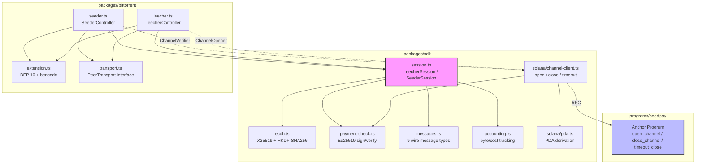
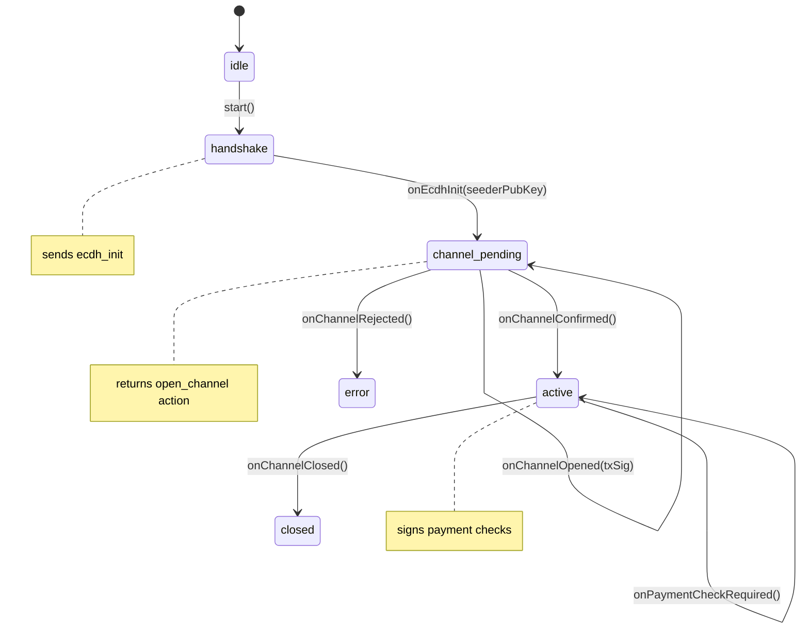
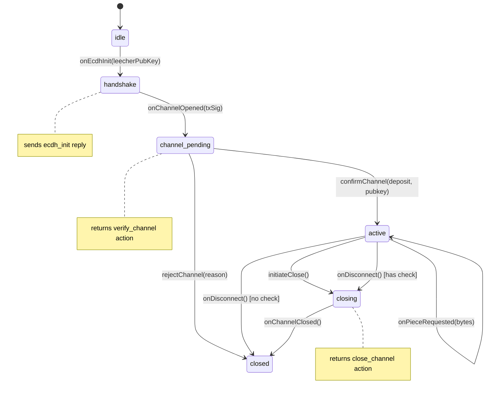
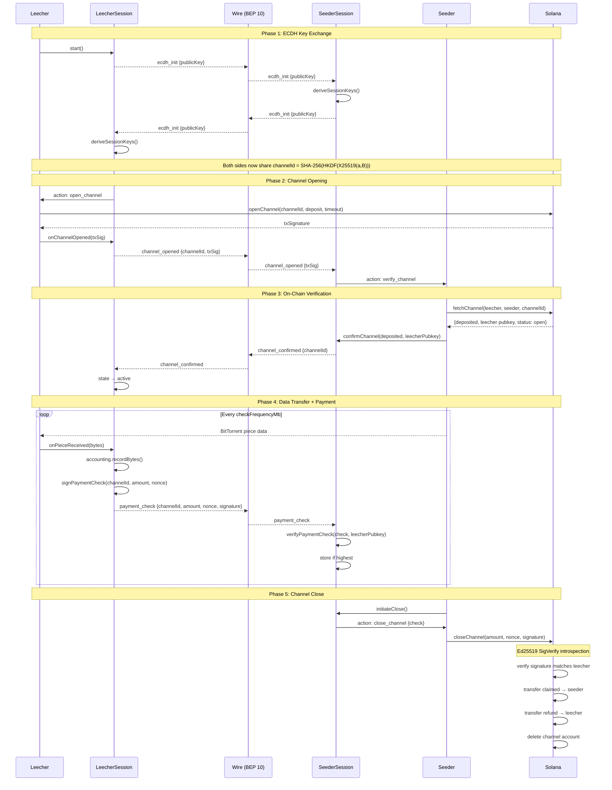
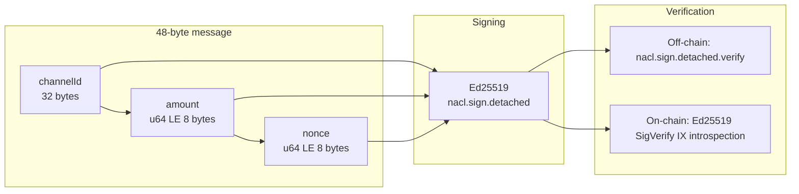
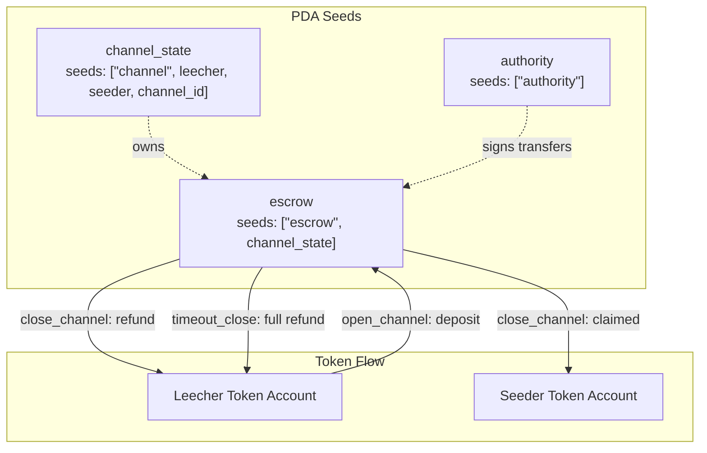
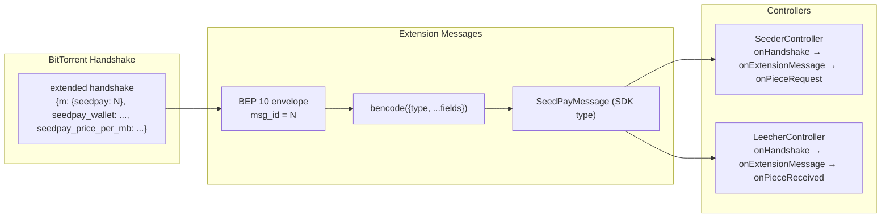

# SeedPay Architecture

## Package Structure

## Session State Machine

### Leecher States

### Seeder States

## Full Protocol Flow (Sequence Diagram)

## Payment Check Signing

## On-Chain PDA Structure

## BitTorrent BEP 10 Integration

