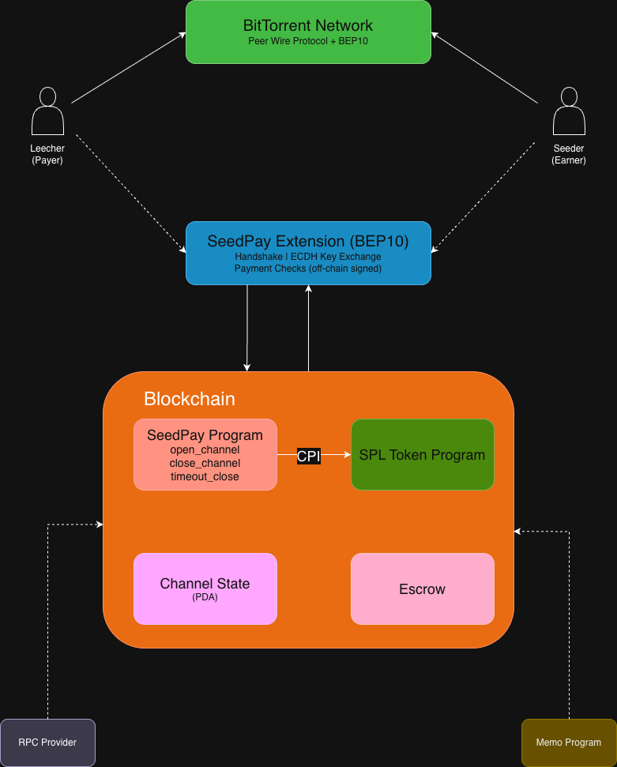
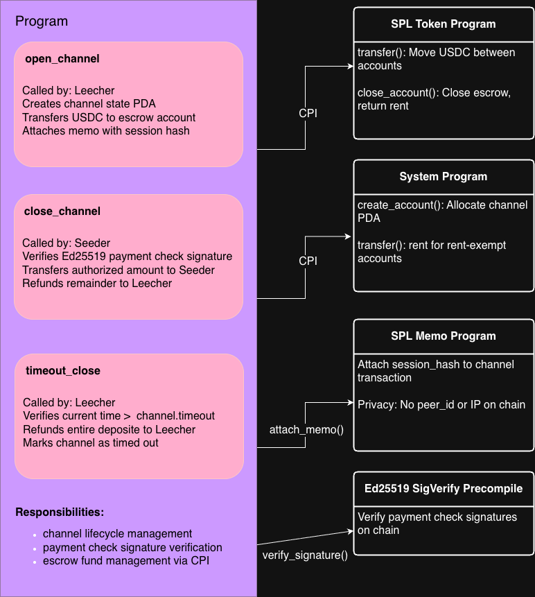
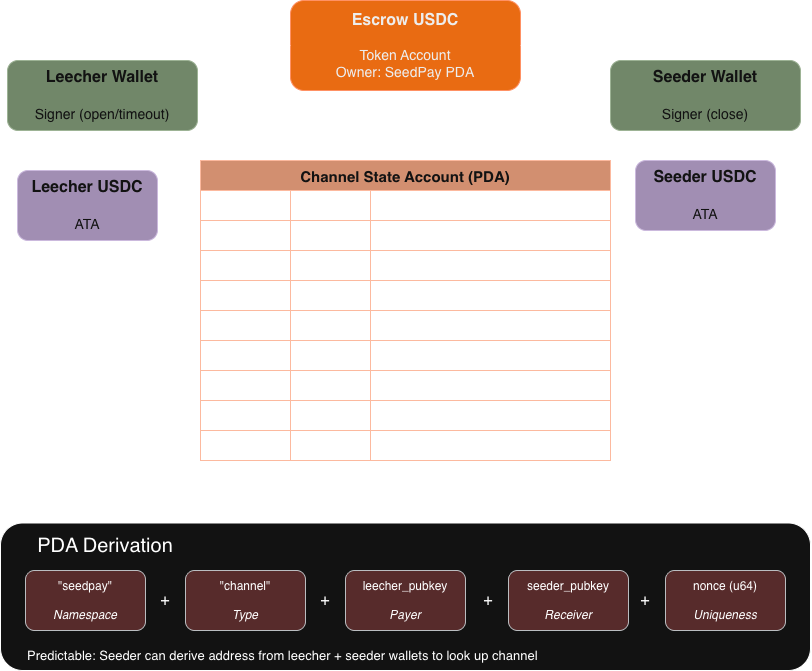
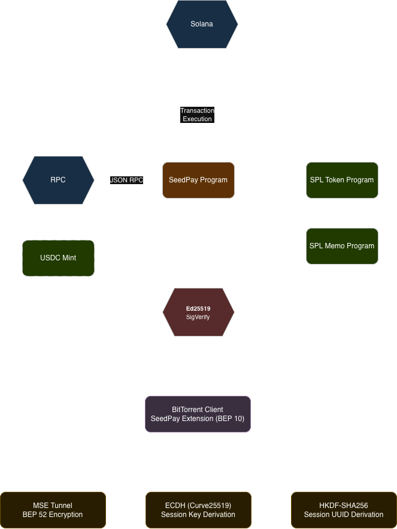
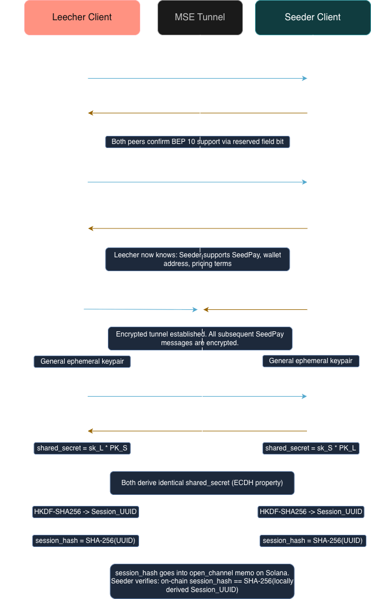
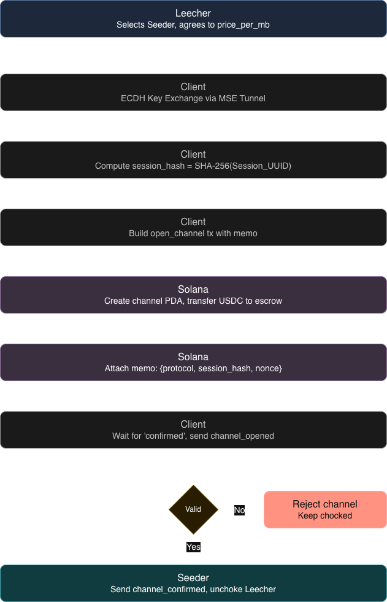
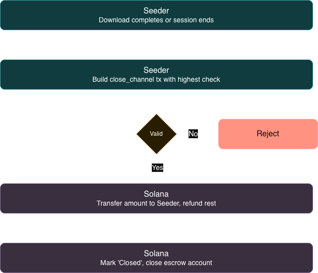
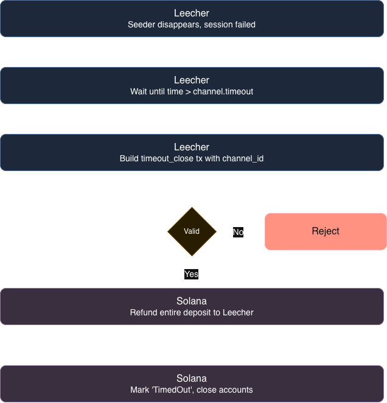
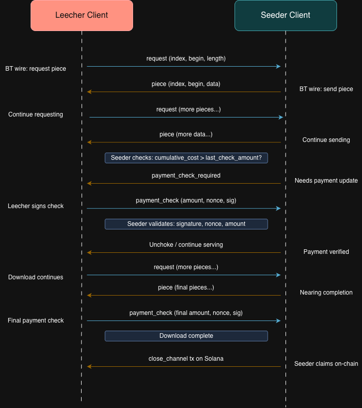

# SeedPay - Architecturel Diagrams

**Capstone Project - Week 3 Assignment**

_Payment Protocol for BitTorrent Networks_  
_Seeders earn crypto for sharing files. Leechers pay for faster downloads._

---

## High Level System Overview

- **How It Works:**
  1. Peers discover each other via BitTorrent and negotiate pricing through SeedPay extension (BEP 10).
  2. Leecher opens a payment channel on Solana (`open_channel`), locking USDC in escrow.
  3. Data transfers via BitTorrent. Leecher sends signed-off payments checks as data is received.
  4. Seeder submits highest payment check to close channel, or Leecher force-recovers after timeout.
  5. ECDH ephemeral keys ensure on-chain payments can not be linked to download activity.

## Program Structure & Instruction Flow

**CPIs:**
SeedPay never handles tokens directly. It invokes SPL Token via CPI. Ed25519 precomiple verifies payment check signatures.
Memo program attaches privacy-preserving session_hash to channel opening transactions.

## Account Structure & PDA

**Account Design Principles:**

1. Predictable PDAs: channel state derived from seeds. Seeder can look it up without an index.
2. Escrow Ownership: Escrow token account is owned by SeedPay program PDA, not by either user.

## External Dependencies & Integrations

## User Interaction Flow

### Handshake & ECDH Key Exchange

### Open Channel (Deposit)

### Close Channel (Cooperative)

### Timeout Close

**Maximum Loss**:

- Cooperative: Seeder gets exactly what Leecher authorized. Remainder refuneded. Both satisfied.
- Timeout: Leecher recovers full deposit. Seeder earns $0. Default timeout: 24 h

## Off-Chain Data Transfer & Payment Check Flow

**Cost Calculation**:
cost = (bytes / 1,048,576) \_ price_per_mb
Payment checks are off-chain (no RPC calls during transfer)

On-chain cost: 2 transactions total (open + close)
Check frequency: every 10-100 MB
